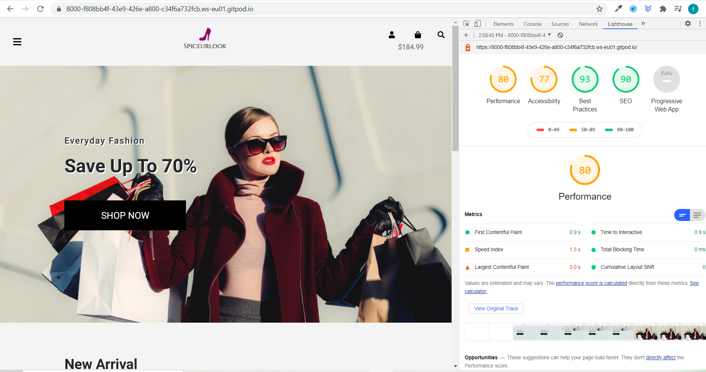
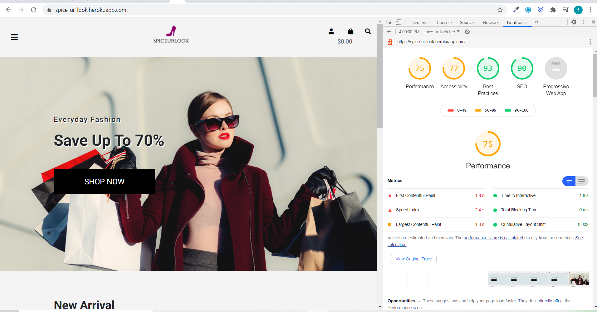

###  TESTING:
The testing process is outlined below. It includes:
* Testing User Stories
* Validating HTML, CSS, JavaScript and python/django code
* Checking site compatibility on different browsers
* Checking responsiveness of design on all screen sizes and break points
* Manually testing the functionality of all links
* Manually testing the newsletter sign up form 
* Automated unit testing for the forms (tests available in tests.py of each app)
* Automated unit testing for the models(tests available in tests.py of each app)
* Automated unit testing for the views(tests available in tests.py of each app)
* Automated unit testing for the urls(tests available in tests.py of each app)
* to run all automated tests: pthon3 manage.py test
##### Automated test files:
1. [Checkout app:](https://github.com/Teemamin/spice_ur_look/blob/master/checkout/tests.py)
2. [Products app:](https://github.com/Teemamin/spice_ur_look/blob/master/products/tests.py)
3. [Profiles app:](https://github.com/Teemamin/spice_ur_look/blob/master/profiles/tests.py)
4. [Shopping_bag app:](https://github.com/Teemamin/spice_ur_look/blob/master/shopping_bag/tests.py)
5. [Home:](https://github.com/Teemamin/spice_ur_look/blob/master/spice_ur_look/tests.py)

* Lighthouse in Chrome Devtools  to check performance:
* [lighthouse_performance report on gitpod:](https://github.com/Teemamin/spice_ur_look/blob/master/lighthouse_performance_report/8000-f808bb4f-43e9-426e-a800-c34f6a732fcb.ws-eu01.gitpod.io-2020)
* 
* [lighthouse_performance report on heroku:](https://github.com/Teemamin/spice_ur_look/blob/master/lighthouse_performance_report/spice-ur-look.herokuapp.com-20201107T160000.json)
* 

#### User stories tests:
Testing user experience:

1. Product Owner:
* can easily add a product via product form 
* can easily edit/update product info
* can easily delete products

2. Sign-up / Login:
* user: can successfully sign up for an account by filling the the required form fields and will recieve a confirmation email
* user : users also have an easy option of socisl login, by providing their google account
* user: users can successfully recover their passwords by clicking on the forgot password: which will send an email to
the provided email adddress with the necessary link for password recovery.
3. Logged in / authenticated users: 
* user: Logged in users can save their default delivery/billing info on their profile page
* user: logged in users can successfully add items to their wishlist for later purchase
* user: logged in users can review products that they have bought
4. authenticated and unauthenticated users:
* user: can successfully browser the site by gender, category or price and make a selection to buy
* user: can successfully view each product details to identify price, read other users reviews on the product,select a product
size or quantity
* user : can quickly use the search icon to search for products they are intrested in 
* user : can easily access products on sale and keep track of their total shopping bag cost throughout the site
i. shopping bag:
* user: can easily access their shopping bag items, which conveniently contains all their selected products, which can be 
added,subtracted or removed  from the shopping bag and the cost recalculates accordingly.
* Easy and secure stripe checkout process with no hassle.
* user: upon successful checkout: user gets redirected to success page with order details and a confirmation email is also sent to the user with their order details.

#### Bug discovered during teting:
* Products app -> products.html -> aside: left alligned browse category was showing up on mobile break point:
- solution: used bootstrap class to hide the section on mobile devices.
* Stripe payment intent.succeeded was returning internal server error: i realized the error was coming from the shopping
bag id returned by stripe intent which was a string type instead of a bag instance, in other for the payment intent to succeed:
i used the string id returned by stripe intent and searched  the Bag model to return the intance matching the id and
used the instance returned to finalize the payment.
- solution: webhooks.py: 
  def handle_payment_intent_succeeded(self, event):
        """
        Handles  payment_intent.succeeded webhook sent Stripe
        """

        intent = event.data.object
        payment_id = intent.id
        bag = intent.metadata.bag
        x = Bag.objects.get(pk=bag)

#### Validating  HTML, CSS and JavaScript and Python/django:
### HTML
* Validated my HTML5 file with  [W3C validator](https://validator.w3.org) : validator produced django template syntax as errors
### Python:
* Validated my python file with inbuilt code institute gitpod python lint : there are still some lint line errors coming from the model character fields
upon the use of both null and blank as True.

### CSS :
* Validated my css file with  [W3C validator](https://jigsaw.w3.org/css-validator/validator) : the test did not produce any errors
### Javascript  :
* Validated my js file with [esprima](https://esprima.org/demo/validate.html)  code issyntactically valid.

#### Compatability Test :
##### i used the following browsers the test the project:
* Bravee
* Internet explorer
* Google Chrome
* Mozilla Fire fox

##### Design Responsiveness:
* I tested the site on google dev tool
* Tested the site on a samsung s10 mobile phone
* Tested the site on iphone X

#### functionality Tests:
* manually tested all the site links to ensure it is all working
* Automated test was carried out: test files can be found in tests.py of each application or the links provided above
* to run all automated tests: pthon3 manage.py test
* [return to previous doc](https://github.com/Teemamin/spice_ur_look/blob/master/README.md)

